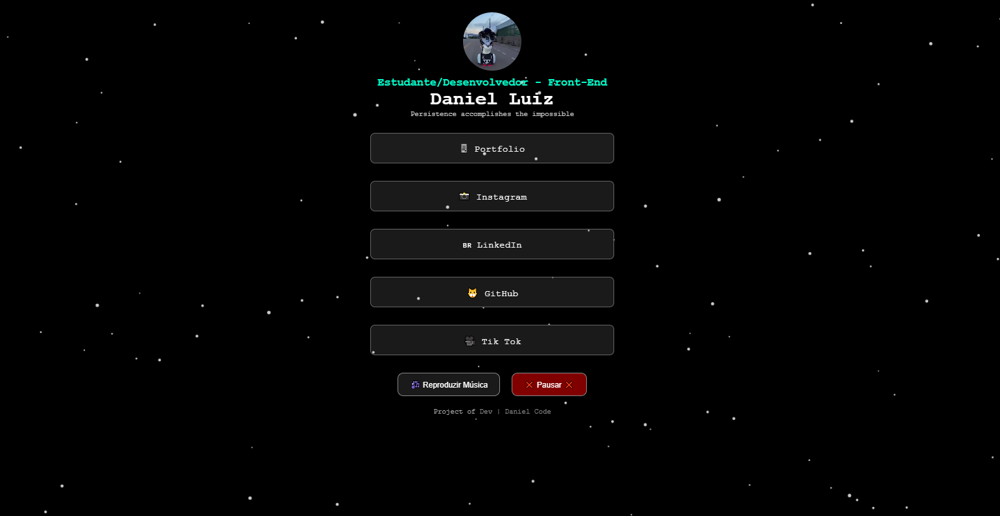

# 💻 Daniel Luiz | Dev Front-End - Página Pessoal



Este é um projeto de página pessoal com animações em canvas, vídeo de perfil e controle de música, desenvolvido utilizando **HTML**, **CSS** e **JavaScript**.

## 🧠 Funcionalidades

- 🎥 Vídeo de perfil reproduzido automaticamente
- 🌧️ Animação de fundo estilo "chuva de partículas"
- 🎵 Botões para tocar e pausar uma música
- 🧭 Navegação com botões de redes sociais
- 📱 Totalmente responsivo para celulares e tablets
- 💡 Animações suaves de entrada para os botões

---

## 🚀 Tecnologias Utilizadas

- HTML5
- CSS3
- JavaScript
- Canvas API (para animação do fundo)

---

## 📷 Visão Geral:

### 🎵 Personalização

    -O arquivo de áudio está localizado em: src/audio/musica.mp3

    -O vídeo de perfil está em: src/img/video-nino.mp4

    -Substitua por seus próprios arquivos mantendo os mesmos nomes (ou altere o caminho no HTML)


### 📁 Estrutura do Projeto

    ├── index.html
    ├── src/
    │   ├── css/
    │   │   └── style.css
    │   ├── js/
    │   │   └── script.js
    │   ├── img/
    │   │   └── video-nino.mp4
    │   └── audio/
    │       └── musica.mp3
---

#### Desenvolvido por Daniel Luiz

---

## 🛠 Como usar este projeto

1. Clone o repositório:

```bash
git clone https://github.com/danielluiz07/link-tree-dl.git

